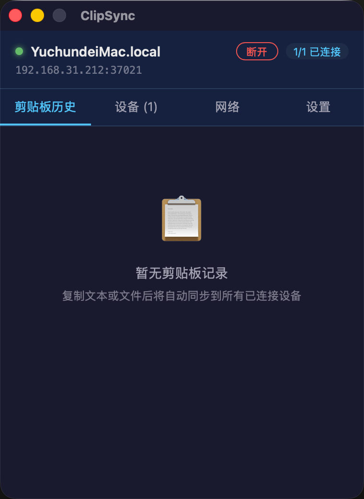
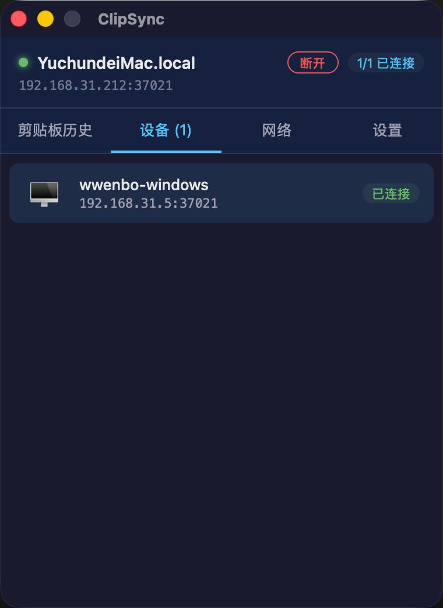
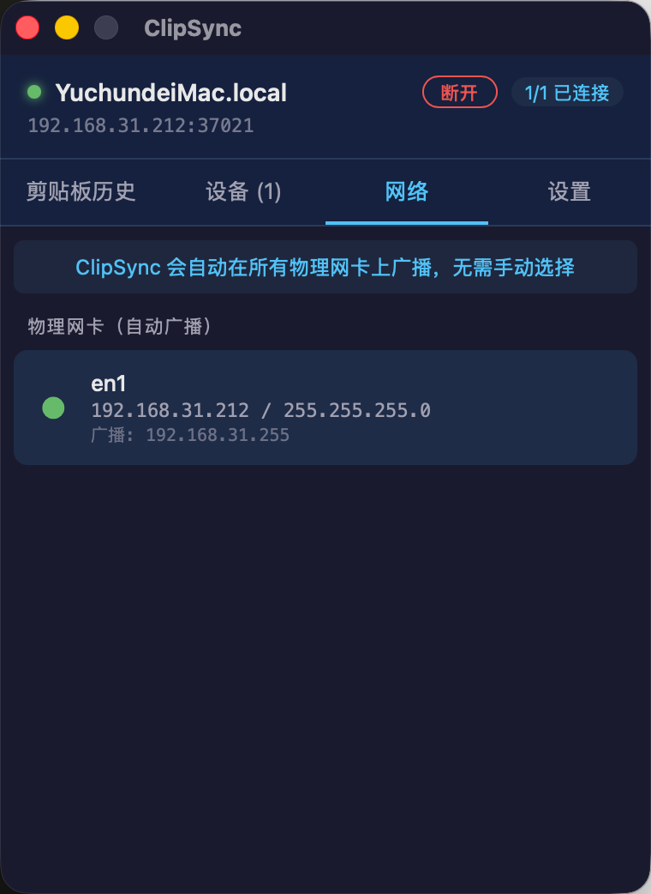

# ClipSync - 跨平台剪贴板同步工具

**中文** | [English](README_EN.md)

局域网内自动发现设备，实时同步剪贴板文本、图片与文件，支持 Mac 和 Windows 互通，内置 9 种语言界面。

## 功能特性

- **自动发现**：UDP 广播自动发现同一局域网内的其他设备
- **实时同步**：复制文本后自动同步到所有已连接设备
- **消息去重**：智能防循环，避免内容来回传播
- **历史记录**：保留最近 20 条剪贴板记录，点击即可复制
- **全局快捷键**：可配置的快捷键快速打开/隐藏窗口（默认 CmdOrCtrl+Shift+V）
- **本机记录显示**：本机复制的文字记录也会显示在历史列表中，方便回溯
- **行内复制按钮**：每条历史记录都有独立复制按钮，快速复用历史内容
- **文件/文件夹同步**：支持复制文件和文件夹后自动传输到其他设备
- **图片同步**：支持截图等内存中图片的跨设备实时同步
- **多语言界面**：支持中文、英语、日语、韩语、德语、法语、西班牙语、葡萄牙语、俄语
- **系统托盘**：最小化运行，随时通过托盘图标打开
- **下载目录设置**：可自定义文件下载保存位置
- **跨平台**：Mac 和 Windows 互通

## 界面预览

| 剪贴板历史 | 设备列表 | 网络管理 |
|:---:|:---:|:---:|
|  |  |  |

## 环境要求

### 通用要求
- **Node.js** v18+（推荐 LTS 版本）
- **Rust** v1.75+（通过 [rustup](https://rustup.rs/) 安装）
- **Git**（用于克隆项目）

### 操作系统要求
- **macOS**：10.15+ (Catalina 或更高版本)
- **Windows**：10+ (64 位)

### 构建工具要求

**macOS 需要安装：**
- Xcode Command Line Tools
  ```bash
  xcode-select --install
  ```

**Windows 需要安装：**
- Visual Studio C++ 构建工具（或 Visual Studio 2019+）
  - 下载 [Visual Studio Build Tools](https://visualstudio.microsoft.com/visual-cpp-build-tools/)
  - 安装时勾选「使用 C++ 的桌面开发」
- WebView2（Windows 10 1809+ 通常已自带）

## 安装步骤

### 方式一：从源码编译安装

#### 前置环境安装

**macOS 环境准备：**

1. **安装 Homebrew**（如果还没有）：
   ```bash
   /bin/bash -c "$(curl -fsSL https://raw.githubusercontent.com/Homebrew/install/HEAD/install.sh)"
   ```

2. **安装 Node.js**：
   ```bash
   brew install node
   ```

3. **安装 Rust**：
   ```bash
   curl --proto '=https' --tlsv1.2 -sSf https://sh.rustup.rs | sh
   source "$HOME/.cargo/env"
   ```

4. **安装 Xcode Command Line Tools**：
   ```bash
   xcode-select --install
   ```

5. **验证安装**：
   ```bash
   node --version    # 应显示 v18 或更高
   rustc --version   # 应显示 1.75 或更高
   ```

**Windows 环境准备：**

1. **安装 Node.js**：
   - 访问 [Node.js 官网](https://nodejs.org/)
   - 下载并安装 LTS 版本（推荐 64 位安装包）
   - 安装后重启终端

2. **安装 Rust**：
   - 下载 [rustup-init.exe](https://win.rustup.rs/x86_64)
   - 运行安装程序，选择默认选项即可
   - 安装完成后重启终端

3. **安装 Visual Studio Build Tools**：
   - 下载 [Visual Studio Build Tools](https://visualstudio.microsoft.com/visual-cpp-build-tools/)
   - 运行安装程序
   - 在「工作负载」中勾选「使用 C++ 的桌面开发」
   - 点击安装

4. **验证安装**（在 PowerShell 或 CMD 中）：
   ```powershell
   node --version    # 应显示 v18 或更高
   rustc --version   # 应显示 1.75 或更高
   ```

#### 项目安装

**1. 克隆项目**

```bash
git clone <repository-url>
cd clip-sync
```

**2. 安装依赖**

```bash
npm install
```

**3. 开发运行**

```bash
npm run tauri dev
```

首次运行会自动下载 Rust 依赖并编译，可能需要几分钟。

**4. 构建发布版本**

**macOS 构建：**
```bash
npm run tauri build
```
构建产物位置：
- DMG 安装包：`src-tauri/target/release/bundle/dmg/`
- APP 应用：`src-tauri/target/release/bundle/macos/`

**Windows 构建：**
```bash
npm run tauri build
```
构建产物位置：
- MSI 安装包：`src-tauri/target/release/bundle/msi/`
- NSIS 安装包：`src-tauri/target/release/bundle/nsis/`

### 方式二：直接安装（推荐普通用户）

**macOS 安装：**
1. 从 Releases 页面下载最新的 `.dmg` 文件
2. 双击 DMG 文件打开
3. 将 ClipSync 拖拽到 Applications 文件夹
4. 在 Launchpad 或 Applications 中运行

**Windows 安装：**
1. 从 Releases 页面下载最新的 `.msi` 或 `.exe` 安装包
2. 双击安装包运行
3. 按照安装向导完成安装
4. 从开始菜单或桌面快捷方式运行

## 使用说明

### 基本操作

1. **启动应用**：运行 ClipSync 后会自动在后台运行，显示在系统托盘中
2. **打开窗口**：点击托盘图标或使用全局快捷键（默认 CmdOrCtrl+Shift+V）即可打开主窗口
3. **查看设备**：切换到「设备列表」标签页，查看已发现的设备
4. **查看历史**：切换到「剪贴板历史」标签页，查看同步记录
5. **复制内容**：点击历史记录后面的「复制」按钮，或在历史条目上点击即可复制到本地剪贴板
6. **修改设置**：切换到「设置」标签页，可修改下载目录和全局快捷键

### 设备互联

**前提条件：**
- 两台设备必须在**同一局域网**（连接同一个 WiFi 或路由器）
- 两台设备都已启动 ClipSync

**连接流程：**
1. 在 Mac 和 Windows 上分别启动 ClipSync
2. 应用会自动通过 UDP 广播发现对方（约 2-5 秒）
3. 发现后自动建立 WebSocket 连接
4. 状态显示「已连接」后即可开始同步

### 剪贴板同步

- 在任意一台设备上复制文本后，会自动同步到所有已连接设备
- **本机记录也会保留在历史列表中**，方便随时回溯使用
- 收到的远程剪贴板内容会显示在「剪贴板历史」中
- 每条记录都有独立的「复制」按钮，点击即可快速复制到本地剪贴板
- 也可以点击历史条目的任意位置来复制内容
- 历史记录最多保留 20 条

### 文件与文件夹同步

- 在本机复制文件或文件夹后，会自动广播给所有已连接设备
- 接收端会在下载目录中保存接收到的文件和文件夹
- **单文件传输**：接收后会自动写入剪贴板，方便直接使用
- **多文件/文件夹传输**：接收后不会写入剪贴板，但可以在历史记录中打开文件位置
- 支持递归复制整个文件夹，保持原有目录结构
- 历史记录中显示文件大小、来源设备、传输状态等信息

### 全局快捷键

- 默认快捷键：`CmdOrCtrl+Shift+V`
- 在「设置」页面中可以自定义快捷键
- 按下快捷键可以快速显示/隐藏主窗口
- 快捷键支持修改后立即生效

### 系统托盘操作

- **左键单击**：显示/隐藏主窗口
- **右键单击**：弹出菜单（显示窗口 / 退出应用）

## 网络端口

ClipSync 使用以下端口，如遇到防火墙拦截，请放行：

| 端口 | 协议 | 用途 |
|------|------|------|
| 37020 | UDP | 设备发现（广播） |
| 37021 | TCP | WebSocket 数据传输 |

## 项目结构

```
clip-sync/
├── package.json              # 前端依赖配置
├── tsconfig.json             # TypeScript 配置
├── vite.config.ts            # Vite 构建配置
├── index.html                # 入口 HTML
├── src/
│   ├── main.tsx              # React 入口
│   ├── App.tsx               # 主界面组件
│   ├── components/
│   │   ├── StatusBar.tsx     # 状态栏（IP/连接数）
│   │   ├── DeviceList.tsx    # 设备列表
│   │   └── ClipHistory.tsx   # 剪贴板历史
│   └── styles/
│       └── app.css           # 全局样式（暗色主题）
└── src-tauri/
    ├── Cargo.toml            # Rust 依赖配置
    ├── tauri.conf.json       # Tauri 应用配置
    ├── build.rs              # Tauri 构建脚本
    ├── capabilities/default.json  # Tauri v2 权限配置
    ├── icons/                # 应用图标
    └── src/
        ├── main.rs           # 程序入口
        ├── lib.rs            # 库入口，模块串联
        ├── state.rs          # 全局状态管理
        ├── discovery.rs      # UDP 广播设备发现
        ├── transport.rs      # WebSocket P2P 通信
        ├── clipboard.rs      # 剪贴板监听与写入
        ├── commands.rs       # Tauri 命令定义
        └── tray.rs           # 系统托盘
```

## 技术栈

| 层级 | 技术 |
|------|------|
| 前端框架 | React 18 + TypeScript |
| 构建工具 | Vite 6 |
| 桌面框架 | Tauri v2 |
| 异步运行时 | Tokio |
| 通信协议 | WebSocket (tokio-tungstenite) |
| 设备发现 | UDP 广播 |
| 剪贴板操作 | arboard |

## 常见问题

### Q: 为什么设备列表中没有发现其他设备？

1. 确认两台设备在同一局域网内
2. 确认防火墙没有阻止 UDP 37020 端口
3. 重启两台设备上的 ClipSync
4. 等待 5-10 秒让设备发现生效

### Q: 复制的内容没有同步到其他设备？

1. 检查设备列表中的状态是否为「已连接」
2. 确认防火墙没有阻止 TCP 37021 端口
3. 尝试在目标设备上手动复制
4. 检查「剪贴板历史」中是否显示本机复制的记录（如果没有，可能是剪贴板监听异常）

### Q: 是否支持图片或文件同步？

当前版本支持**纯文本**剪贴板同步、**图片**同步（包括截图等内存中图片）以及**文件/文件夹**的自动传输。

### Q: 可以在不同网络环境下使用吗？

当前版本仅支持**局域网**设备发现。远程同步需要额外配置中继服务器，暂不支持。

### Q: 如何查看运行日志？

开发模式下日志会输出到终端：

```bash
RUST_LOG=debug npm run tauri dev
```

生产模式日志默认不输出，可通过环境变量开启。

## 开发指南

### 常用命令

```bash
# 开发模式（热重载）
npm run tauri dev

# 仅运行前端（不编译 Rust）
npm run dev

# 构建发布版本
npm run tauri build

# 清理构建缓存
cargo clean -p clip-sync
```

### 调试技巧

- 打开开发者工具：在 Tauri 窗口右键 → 检查元素
- 查看 Rust 日志：在终端中设置 `RUST_LOG=debug`
- 网络抓包：使用 Wireshark 查看 UDP 广播和 WebSocket 连接

## 许可证

MIT License
